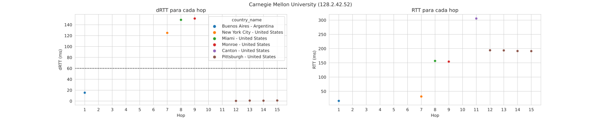
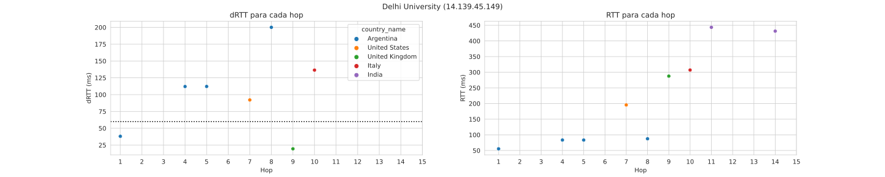
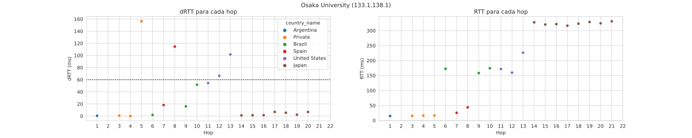

# Taller 2 - Traceroute

## Integrantes

| LU     | Nombre            | Mail                      |
| ------ | ----------------- | ------------------------- |
| 72/18  | Manuel Panichelli | panicmanu@gmail.com       |
| 76/16  | Luciano Strika    | lucianostrika44@gmail.com |
| 692/12 | Elías Cerdeira    | eliascerdeira@gmail.com   |

## Introducción

<!-- 200 palabras -->
<!-- Breve explicación de los experimentos que se van a realizar. -->

Traceroute es una de las herramientas para diagnóstico de red más utilizadas dada su simplicidad y amplia gama de aplicaciones. En este trabajo, se realiza una implementación alternativa en python utilizando la biblioteca [`scapy`](https://scapy.net/) para la interacción con la red.

La implementacion se basa en enviar paquetes ICMP echo incrementando el ttl hasta llegar al destino, lo cual permite mediante los paquetes de error ICMP por ttl excedido obtener los routers que componen la ruta y el RTT hacia cada uno de ellos. Esto es suceptible a muchas anomalias que se exploran en el informe

Se prueba pegándole a diferentes universidades alrededor del mundo, y se realiza una predicción manual de qué saltos son interocéanicos basado en el RTT y el RTT entre saltos (dRTT).

Finalmente, se sofistica la predicción usando Cimbala???

## Métodos y condiciones de los experimentos

<!-- 400 palabras -->
<!-- Explicación del código implementado y descripciones de las rutas. Se debe detallar la localización geográfica de cada universidad y
las características de las pruebas -horario, día de la semana, etc.- -->

Se realizó una implementación alternativa de traceroute en Python 3 con la biblioteca `scapy`. Se envían paquetes `ICMP` sobre `IP` al sitio web de cada universidad, incrementando el TTL para ir de hop en hop. Para cada TTL se realizan 5 iteraciones. Para calcular el RTT hacia cada IP, solo se considera aquella que presentó una mayor cantidad de respuestas. Se calcula la mediana y el desvío estándar.

Luego, para validar la predicción de saltos interoceánicos, se consume el servicio [`ipinfo`](https://ipinfo.io/) y se amplían los resultados con información geográfica y organizacional.

Las universidades estudiadas son:

- [Carnegie Mellon (_Carne y Melón_) University - Estados Unidos](https://www.cmu.edu/)
- [Delhi University - India](http://www.du.ac.in/)
- [Osaka University - Japón](https://www.osaka-u.ac.jp/)

Y las pruebas fueron ejecutadas a las 20:00 del 22/05/2021.

## Resultados de los experimentos

<!-- 600 palabras -->
<!-- En esta sección deben presentarse figuras
y/o tablas que muestren de manera integral los resultados observados. A modo de sugerencia, se puede
mostrar un gráfico de RTT entre saltos que se deduce de restar los valores promediados a cada salto y/o
RTT total a cada salto. -->

A continuación se exponen los resultados de la ejecución del programa implementado para la distintas universidades nombradas en la sección anterior. Para cada una, se muestra una tabla cuya columna "Interoceánico" es la predicción hecha solamente según el dRTT y los RTTs del camino, que se puede contrastar con la información geográfica (columna Location) obtenida a partir de `ipinfo`.

### Carnegie Mellon

[Carnegie Mellon (_Carne y Melón_) University - Estados Unidos](https://www.cmu.edu/) (`128.2.42.52`) (Luciano)

|  Hop  |      IP       |    RTT    |    SD     |  dRTT   | Interoceánico |                           Location                           |
| :---: | :-----------: | :-------: | :-------: | :-----: | :-----------: | :----------------------------------------------------------: |
|   1   |  192.168.0.1  | 16.38 ms  | 11.09 ms  |  15.34  |       -       |                              -                               |
|   2   |     * * *     |     -     |     -     |    -    |       -       |                              -                               |
|   3   |     * * *     |     -     |     -     |    -    |       -       |                              -                               |
|   4   |     * * *     |     -     |     -     |    -    |       -       |                              -                               |
|   5   |     * * *     |     -     |     -     |    -    |       -       |                              -                               |
|   6   |     * * *     |     -     |     -     |    -    |       -       |                              -                               |
|   7   | 8.243.138.29  | 31.72 ms  |  6.18 ms  | 125.02  |      Si       | (New York City - United States, AS3356 Level 3 Parent, LLC)  |
|   8   |  4.69.207.33  | 156.74 ms |  0.45 ms  | 148.89  |      No       |     (Miami - United States, AS3356 Level 3 Parent, LLC)      |
|   9   | 4.68.111.110  | 154.27 ms |  1.59 ms  | 151.36  |      No       |     (Monroe - United States, AS3356 Level 3 Parent, LLC)     |
|  10   |     * * *     |     -     |     -     |    -    |       -       |                              -                               |
|  11   |  66.3.25.94   | 305.63 ms | 142.46 ms | -114.27 |      No       | (Canton - United States, AS2828 MCI Communications Services) |
|  12   | 128.2.255.193 | 194.06 ms |  2.46 ms  |  0.36   |      No       | (Pittsburgh - United States, AS9 Carnegie Mellon University) |
|  13   | 128.2.255.202 | 193.59 ms |  1.04 ms  |  0.84   |      No       | (Pittsburgh - United States, AS9 Carnegie Mellon University) |
|  14   |  128.2.42.52  | 191.45 ms |  2.10 ms  |  0.69   |      No       | (Pittsburgh - United States, AS9 Carnegie Mellon University) |

### Delhi University

`14.139.45.149` (http://www.du.ac.in/, Delhi University, India) (Manuel)

|  Hop  |       IP        |    RTT    |    SD    |  dRTT  | Interoceánico |                             Location                              |
| :---: | :-------------: | :-------: | :------: | :----: | :-----------: | :---------------------------------------------------------------: |
|   1   |  192.168.43.1   | 55.42 ms  | 27.70 ms | 38.06  |      No       |                              Privada                              |
|   2   |      * * *      |     -     |    -     | -1.00  |       -       |                                 -                                 |
|   3   |  172.25.199.97  | 93.48 ms  | 2.78 ms  | 102.04 |      No       |                              Privada                              |
|   4   |  181.96.96.181  | 83.45 ms  | 87.77 ms | 112.06 |      No       |     (Buenos Aires - Argentina, AS7303 Telecom Argentina S.A.)     |
|   5   |  181.88.68.142  | 83.37 ms  | 12.46 ms | 112.14 |      No       |     (Buenos Aires - Argentina, AS7303 Telecom Argentina S.A.)     |
|   6   |      * * *      |     -     |    -     | -1.00  |       -       |                                 -                                 |
|   7   | 181.96.113.234  | 195.51 ms | 0.00 ms  | 92.08  |      No       |  (New York City - United States, AS7303 Telecom Argentina S.A.)   |
|   8   |  195.22.220.56  | 87.49 ms  | 15.57 ms | 200.10 |      Sí       | (Buenos Aires - Argentina, AS6762 TELECOM ITALIA SPARKLE S.p.A.)  |
|   9   | 195.22.209.220  | 287.59 ms | 11.52 ms | 19.46  |      No       |  (London - United Kingdom, AS6762 TELECOM ITALIA SPARKLE S.p.A.)  |
|  10   |  149.3.183.137  | 307.05 ms | 18.79 ms | 136.47 |      Sí       |       (Rome - Italy, AS6762 TELECOM ITALIA SPARKLE S.p.A.)        |
|  11   |  85.95.27.121   | 443.51 ms | 91.47 ms | -12.20 |      No       |       (Mumbai - India, AS15412 Reliance Globalcom Limited)        |
|  12   |      * * *      |     -     |    -     | -1.00  |       -       |                                 -                                 |
|  13   |      * * *      |     -     |    -     | -1.00  |       -       |                                 -                                 |
|  14   | 124.124.195.101 | 431.32 ms | 16.61 ms |  0.00  |      No       | (Airoli - India, AS18101 Reliance Communications Ltd.DAKC MUMBAI) |
|  15   |      * * *      |     -     |    -     | -1.00  |       -       |                                 -                                 |
|  16   |      * * *      |     -     |    -     | -1.00  |       -       |                                 -                                 |
|  17   |      * * *      |     -     |    -     | -1.00  |       -       |                                 -                                 |
|  18   |      * * *      |     -     |    -     | -1.00  |       -       |                                 -                                 |
|  19   |      * * *      |     -     |    -     | -1.00  |       -       |                                 -                                 |
|  20   |      * * *      |     -     |    -     | -1.00  |       -       |                                 -                                 |

### Osaka University

`133.1.138.1` (https://www.osaka-u.ac.jp/ - Osaka University, Japón) (Elias)

|  Hop  |       IP       |    RTT    |    SD    |   dRTT    | Interoceánico |                                 Location                                 |
| :---: | :------------: | :-------: | :------: | :-------: | :-----------: | :----------------------------------------------------------------------: |
|   1   |  192.168.1.1   | 17.17 ms  | 7.37 ms  | 155.38 ms |      No       |                                                                          |
|   2   | 200.51.241.181 | 14.76 ms  | 13.55 ms |  0.50 ms  |      No       |       (Buenos Aires - Argentina, AS10834 Telefonica de Argentina)        |
|   3   |     * * *      |    N/A    |   N/A    |    N/A    |      N/A      |                                                                          |
|   4   |  10.192.19.58  | 15.26 ms  | 1.57 ms  |  0.82 ms  |      No       |                                                                          |
|   5   |  10.192.19.52  | 16.08 ms  | 1.15 ms  |  0.12 ms  |      No       |                                                                          |
|   6   |  10.192.18.12  | 16.20 ms  | 2.08 ms  | 156.34 ms |      No       |                                                                          |
|   7   | 94.142.98.192  | 172.55 ms | 5.33 ms  |  1.86 ms  |      No       |       (São Paulo - Brazil, AS12956 TELEFONICA GLOBAL SOLUTIONS SL)       |
|   8   | 213.140.39.116 | 25.51 ms  | 40.84 ms | 18.26 ms  |      No       |         (Madrid - Spain, AS12956 TELEFONICA GLOBAL SOLUTIONS SL)         |
|   9   | 176.52.249.39  | 43.76 ms  | 3.28 ms  | 114.61 ms |      Sí       |         (Madrid - Spain, AS12956 TELEFONICA GLOBAL SOLUTIONS SL)         |
|  10   | 94.142.98.123  | 158.37 ms | 0.00 ms  | 16.03 ms  |      No       |       (São Paulo - Brazil, AS12956 TELEFONICA GLOBAL SOLUTIONS SL)       |
|  11   | 94.142.98.192  | 174.40 ms | 13.18 ms | 51.71 ms  |      No       |       (São Paulo - Brazil, AS12956 TELEFONICA GLOBAL SOLUTIONS SL)       |
|  12   | 129.250.8.117  | 171.71 ms | 4.10 ms  | 54.39 ms  |      No       |           (Ashburn - United States, AS2914 NTT America, Inc.)            |
|  13   | 129.250.2.144  | 159.62 ms | 4.54 ms  | 66.49 ms  |      Sí       |           (Ashburn - United States, AS2914 NTT America, Inc.)            |
|  14   | 129.250.6.237  | 226.11 ms | 2.69 ms  | 101.67 ms |      Sí       |           (San Jose - United States, AS2914 NTT America, Inc.)           |
|  15   | 129.250.2.119  | 327.77 ms | 8.30 ms  |  1.11 ms  |      No       |                (Osaka - Japan, AS2914 NTT America, Inc.)                 |
|  16   | 129.250.3.232  | 320.50 ms | 9.22 ms  |  1.33 ms  |      No       |                (Osaka - Japan, AS2914 NTT America, Inc.)                 |
|  17   | 61.200.91.154  | 321.82 ms | 1.94 ms  |  1.51 ms  |      No       |                (Osaka - Japan, AS2914 NTT America, Inc.)                 |
|  18   |  150.99.64.58  | 316.43 ms | 11.36 ms |  6.91 ms  |      No       | (Osaka - Japan, AS2907 Research Organization of Information and Systems) |
|  19   | 150.99.188.62  | 323.33 ms | 2.37 ms  |  5.55 ms  |      No       | (Kobe - Japan, AS2907 Research Organization of Information and Systems)  |
|  20   |   133.1.0.10   | 328.88 ms | 12.04 ms |  2.31 ms  |      No       |                 (Suita - Japan, AS4730 Osaka University)                 |
|  21   |  133.1.14.33   | 324.41 ms | 5.82 ms  |  6.77 ms  |      No       |                 (Suita - Japan, AS4730 Osaka University)                 |
|  22   |  133.1.14.46   | 331.18 ms | 17.49 ms |  0.00 ms  |      No       |                 (Suita - Japan, AS4730 Osaka University)                 |
|  23   |     * * *      |    N/A    |   N/A    |    N/A    |      N/A      |                                                                          |
|  24   |     * * *      |    N/A    |   N/A    |    N/A    |      N/A      |                                                                          |
|  25   |     * * *      |    N/A    |   N/A    |    N/A    |      N/A      |                                                                          |
|  26   |     * * *      |    N/A    |   N/A    |    N/A    |      N/A      |                                                                          |
|  27   |     * * *      |    N/A    |   N/A    |    N/A    |      N/A      |                                                                          |
|  28   |     * * *      |    N/A    |   N/A    |    N/A    |      N/A      |                                                                          |
|  29   |     * * *      |    N/A    |   N/A    |    N/A    |      N/A      |                                                                          |
|  30   |     * * *      |    N/A    |   N/A    |    N/A    |      N/A      |                                                                          |

**NOTA:** Para el caso del hop 7 notamos un incremento local y anómalo en el RTT. Creemos que esto puede deberse a que  
el host puede asignar distintos grados de prioridad a los diferentes protocolos de mensajería. Esto resultaría en que la respuesta de ICMP se aplace en el tiempo.

- **¿Qué porcentaje de saltos no responden los Time exceeded? ¿Cuál es el largo de la ruta en terminos de los saltos que si responden?**

  Aproximadamente el 27% no responde y el largo es 21 hops.

- **¿La ruta tiene enlaces intercontinentales? ¿Cuántos?**

  Si, 2. Se predijeron 3, pero el hop 13-14 tenía un RTT alto por ser de una punta a otra de Estados Unidos.

- **¿Se observaron comportamientos anómalos del tipo descripto en la bibliografía sugerida?**

  Si,

  - Missing hops
  - Missing destination
  - False RTTs
  - False Links

    Del hop 7 (San Pablo) al 10 (San Pablo) pasa por Madrid. Se observa el camino Argentina -> San Pablo -> Madrid -> San Pablo -> USA, cuando en realidad se cree que se trata de dos caminos mezclados,

    1. Argentina -> San Pablo -> USA
    2. Argenitna -> San Pablo -> Madrid -> USA

- **¿Se observaron otros comportamientos anómalos? Proponga hipótesis que permitan explicarlos.**

  No se observa ningún comportamiento anómalo que no sea nombrado en la bibliografía sugerida.

## Conclusiones

<!-- 200 palabras -->
<!-- Breve reseña que sintetize las principales dificultades y des-
cubrimientos. -->