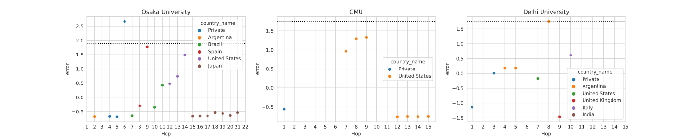

# Taller 2 - Traceroute

## Contenidos

- [Taller 2 - Traceroute](#taller-2---traceroute)
  - [Contenidos](#contenidos)
  - [Integrantes](#integrantes)
  - [Introducción](#introducción)
  - [Métodos y condiciones de los experimentos](#métodos-y-condiciones-de-los-experimentos)
  - [Resultados de los experimentos](#resultados-de-los-experimentos)
    - [Carnegie Mellon University (CMU)](#carnegie-mellon-university-cmu)
    - [Delhi University](#delhi-university)
    - [Osaka University](#osaka-university)
    - [Predicción automática de saltos intercontinentales](#predicción-automática-de-saltos-intercontinentales)
  - [Conclusiones](#conclusiones)

## Integrantes

| LU     | Nombre            | Mail                      |
| ------ | ----------------- | ------------------------- |
| 72/18  | Manuel Panichelli | panicmanu@gmail.com       |
| 76/16  | Luciano Strika    | lucianostrika44@gmail.com |
| 692/12 | Elías Cerdeira    | eliascerdeira@gmail.com   |

## Introducción

<!-- 200 palabras -->
<!-- Breve explicación de los experimentos que se van a realizar. -->

Traceroute es una de las herramientas para diagnóstico de red más utilizadas dada su simplicidad y amplia gama de aplicaciones. En este trabajo, se realiza una implementación alternativa en python utilizando la biblioteca [`scapy`](https://scapy.net/) para la interacción con la red.

La implementacion se basa en enviar paquetes ICMP echo incrementando el ttl hasta llegar al destino, lo cual permite mediante los paquetes de error ICMP por ttl excedido obtener los routers que componen la ruta y el RTT hacia cada uno de ellos. Esto es suceptible a muchas anomalias que se exploran en el informe

Se prueba pegándole a diferentes universidades alrededor del mundo, y se realiza una predicción manual de qué saltos son interocéanicos basado en el RTT y el RTT entre saltos (dRTT).

Finalmente, se sofistica la predicción usando el método de deteccion de outliers propuesto por [Cimbala](https://www.me.psu.edu/cimbala/me345/Lectures/Outliers.pdf).

## Métodos y condiciones de los experimentos

<!-- 400 palabras -->
<!-- Explicación del código implementado y descripciones de las rutas. Se debe detallar la localización geográfica de cada universidad y
las características de las pruebas -horario, día de la semana, etc.- -->

Se realizó una implementación alternativa de traceroute en Python 3 con la biblioteca `scapy`. Se envían paquetes `ICMP` sobre `IP` al sitio web de cada universidad, incrementando el TTL para ir de hop en hop. Para cada TTL se realizan 5 iteraciones. Para calcular el RTT hacia cada IP, solo se considera aquella que presentó una mayor cantidad de respuestas. Se calcula la mediana y el desvío estándar. Para la predicción automática de saltos interoceánicos, se implementó el método de [Cimbala](https://www.me.psu.edu/cimbala/me345/Lectures/Outliers.pdf) para una muestra de variable única (`dRTT`).

Luego, para validar la predicción de saltos interoceánicos, se consume el servicio [`ipinfo`](https://ipinfo.io/) y se amplían los resultados con información geográfica y organizacional.

Las universidades estudiadas son:

- [Carnegie Mellon (_Carne y Melón_) University - Estados Unidos](https://www.cmu.edu/)
- [Delhi University - India](http://www.du.ac.in/)
- [Osaka University - Japón](https://www.osaka-u.ac.jp/)

Y las pruebas fueron ejecutadas a las 20:00 del 22/05/2021.

## Resultados de los experimentos

<!-- 600 palabras -->
<!-- En esta sección deben presentarse figuras
y/o tablas que muestren de manera integral los resultados observados. A modo de sugerencia, se puede
mostrar un gráfico de RTT entre saltos que se deduce de restar los valores promediados a cada salto y/o
RTT total a cada salto. -->

A continuación se exponen los resultados de la ejecución del programa implementado para la distintas universidades nombradas en la sección anterior. Para cada una, se muestra una tabla cuya columna "Interoceánico" es la predicción hecha solamente según el dRTT y los RTTs del camino, que se puede contrastar con la información geográfica (columna Location) obtenida a partir de `ipinfo`. Se expone un gráfico con el RTT incremental para cada hop y el dRTT junto con el umbral considerado para saltos interoceánicos como una línea punteada. Además, se traza la ruta obtenida sobre un mapa.

### Carnegie Mellon University (CMU)

[Carnegie Mellon (_Carne y Melón_) University - Estados Unidos](https://www.cmu.edu/) (`128.2.42.52`) (Luciano)

|  Hop  |      IP       |    RTT    |    SD     |  dRTT  | Interoceánico |                          Location                          |
| :---: | :-----------: | :-------: | :-------: | :----: | :-----------: | :--------------------------------------------------------: |
|   1   |  192.168.0.1  | 16.38 ms  | 11.09 ms  | 15.34  |       -       |                             -                              |
|   2   |     * * *     |     -     |     -     |   -    |       -       |                             -                              |
|   3   |     * * *     |     -     |     -     |   -    |       -       |                             -                              |
|   4   |     * * *     |     -     |     -     |   -    |       -       |                             -                              |
|   5   |     * * *     |     -     |     -     |   -    |       -       |                             -                              |
|   6   |     * * *     |     -     |     -     |   -    |       -       |                             -                              |
|   7   | 8.243.138.29  | 31.72 ms  |  6.18 ms  | 125.02 |      Si       | New York City - United States, AS3356 Level 3 Parent, LLC  |
|   8   |  4.69.207.33  | 156.74 ms |  0.45 ms  | 148.89 |      No       |     Miami - United States, AS3356 Level 3 Parent, LLC      |
|   9   | 4.68.111.110  | 154.27 ms |  1.59 ms  | 151.36 |      No       |     Monroe - United States, AS3356 Level 3 Parent, LLC     |
|  10   |     * * *     |     -     |     -     |   -    |       -       |                             -                              |
|  11   |  66.3.25.94   | 305.63 ms | 142.46 ms |   0    |      No       | Canton - United States, AS2828 MCI Communications Services |
|  12   | 128.2.255.193 | 194.06 ms |  2.46 ms  |  0.36  |      No       | Pittsburgh - United States, AS9 Carnegie Mellon University |
|  13   | 128.2.255.202 | 193.59 ms |  1.04 ms  |  0.84  |      No       | Pittsburgh - United States, AS9 Carnegie Mellon University |
|  14   |  128.2.42.52  | 191.45 ms |  2.10 ms  |  0.69  |      No       | Pittsburgh - United States, AS9 Carnegie Mellon University |

RTTs:


Ruta:


- **¿Qué porcentaje de saltos no responden los Time exceeded? ¿Cuál es el largo de la ruta en terminos de los saltos que si responden?**

  Aproximadamente el 43% no responde y el largo es 8 hops.

- **¿La ruta tiene enlaces intercontinentales? ¿Cuántos?**

  Seguro tiene un enlace intercontinental porque va a Estados Unidos, pero no aparece en el traceroute. El salto predicho es incorrecto, ya que en el hop 7 el paquete ya se encontraba en el otro continente.

- **¿Se observaron comportamientos anómalos del tipo descripto en la bibliografía sugerida?**

  Si,

  - Missing hops
  - False RTTs: Se observa que el hop 11 presenta un RTT más alto de lo esperado dada la región geográfica.

    Posibles hipótesis para explicarlo son:

    - La ruta hacia ese router es asimétrica. Como menciona la bibliografía sugerida, podría suceder que vuelva por una ruta distinta, potencialmente más larga o congestionada.
    - El router presenta distintos grados de prioridad para cada tarea, por lo que el envío de los mensajes *Time exceeded* es aplazado en el tiempo.
    - El router se vio momentáneamente congestionado al momento de la prueba. Se cree que es la más probable, ya que se realizó la prueba en otro momento y presentó menos demora.

- **¿Se observaron otros comportamientos anómalos? Proponga hipótesis que permitan explicarlos.**

  No se observa ningún comportamiento anómalo que no sea nombrado en la bibliografía sugerida.

### Delhi University

`14.139.45.149` (http://www.du.ac.in/, Delhi University, India) (Manuel)

|  Hop  |       IP        |    RTT    |    SD    |  dRTT  | Interoceánico |                            Location                             |
| :---: | :-------------: | :-------: | :------: | :----: | :-----------: | :-------------------------------------------------------------: |
|   1   |  192.168.43.1   | 55.42 ms  | 27.70 ms | 38.06  |      No       |                             Privada                             |
|   2   |      * * *      |     -     |    -     |   -    |       -       |                                -                                |
|   3   |  172.25.199.97  | 93.48 ms  | 2.78 ms  | 102.04 |      No       |                             Privada                             |
|   4   |  181.96.96.181  | 83.45 ms  | 87.77 ms | 112.06 |      No       |     Buenos Aires - Argentina, AS7303 Telecom Argentina S.A.     |
|   5   |  181.88.68.142  | 83.37 ms  | 12.46 ms | 112.14 |      No       |     Buenos Aires - Argentina, AS7303 Telecom Argentina S.A.     |
|   6   |      * * *      |     -     |    -     |   -    |       -       |                                -                                |
|   7   | 181.96.113.234  | 195.51 ms | 0.00 ms  | 92.08  |      No       |  New York City - United States, AS7303 Telecom Argentina S.A.   |
|   8   |  195.22.220.56  | 87.49 ms  | 15.57 ms | 200.10 |      Sí       | Buenos Aires - Argentina, AS6762 TELECOM ITALIA SPARKLE S.p.A.  |
|   9   | 195.22.209.220  | 287.59 ms | 11.52 ms | 19.46  |      No       |  London - United Kingdom, AS6762 TELECOM ITALIA SPARKLE S.p.A.  |
|  10   |  149.3.183.137  | 307.05 ms | 18.79 ms | 136.47 |      Sí       |       Rome - Italy, AS6762 TELECOM ITALIA SPARKLE S.p.A.        |
|  11   |  85.95.27.121   | 443.51 ms | 91.47 ms | -12.20 |      No       |       Mumbai - India, AS15412 Reliance Globalcom Limited        |
|  12   |      * * *      |     -     |    -     |   -    |       -       |                                -                                |
|  13   |      * * *      |     -     |    -     |   -    |       -       |                                -                                |
|  14   | 124.124.195.101 | 431.32 ms | 16.61 ms |  0.00  |      No       | Airoli - India, AS18101 Reliance Communications Ltd.DAKC MUMBAI |
|  15   |      * * *      |     -     |    -     |   -    |       -       |                                -                                |
|  16   |      * * *      |     -     |    -     |   -    |       -       |                                -                                |
|  17   |      * * *      |     -     |    -     |   -    |       -       |                                -                                |
|  18   |      * * *      |     -     |    -     |   -    |       -       |                                -                                |
|  19   |      * * *      |     -     |    -     |   -    |       -       |                                -                                |
|  20   |      * * *      |     -     |    -     |   -    |       -       |                                -                                |

RTTs:


Ruta:


- **¿Qué porcentaje de saltos no responden los Time exceeded? ¿Cuál es el largo de la ruta en terminos de los saltos que si responden?**

  Aproximadamente el 50% no responde y el largo es 11 hops.

- **¿La ruta tiene enlaces intercontinentales? ¿Cuántos?**

  Si, 3, pero se predijeron 2. El salto 5 (Buenos Aires) - 7 (NYC) no se lo consideró como interoceánico porque en el 8 vuelve a Buenos Aires, con lo que se pensó que era una anomalía.

- **¿Se observaron comportamientos anómalos del tipo descripto en la bibliografía sugerida?**

  Si,

  - Missing hops
  - Missing destination
  - False Links

    El tramo 5 - 9 induce a pensar que existe una ruta BA -> NYC -> BA -> UK. Se cree que en realidad se trata de dos rutas mezcladas,

    1. BA -> NYC -> UK
    2. BA -> BA -> UK

- **¿Se observaron otros comportamientos anómalos? Proponga hipótesis que permitan explicarlos.**

  No se observa ningún comportamiento anómalo que no sea nombrado en la bibliografía sugerida.

### Osaka University

`133.1.138.1` (https://www.osaka-u.ac.jp/ - Osaka University, Japón) (Elias)

|  Hop  |       IP       |    RTT    |    SD    |   dRTT    | Interoceánico |                                Location                                |
| :---: | :------------: | :-------: | :------: | :-------: | :-----------: | :--------------------------------------------------------------------: |
|   1   |  192.168.1.1   | 17.17 ms  | 7.37 ms  | 155.38 ms |      No       |                                                                        |
|   2   | 200.51.241.181 | 14.76 ms  | 13.55 ms |  0.50 ms  |      No       |       Buenos Aires - Argentina, AS10834 Telefonica de Argentina        |
|   3   |     * * *      |    N/A    |   N/A    |    N/A    |      N/A      |                                                                        |
|   4   |  10.192.19.58  | 15.26 ms  | 1.57 ms  |  0.82 ms  |      No       |                                                                        |
|   5   |  10.192.19.52  | 16.08 ms  | 1.15 ms  |  0.12 ms  |      No       |                                                                        |
|   6   |  10.192.18.12  | 16.20 ms  | 2.08 ms  | 156.34 ms |      No       |                                                                        |
|   7   | 94.142.98.192  | 172.55 ms | 5.33 ms  |  1.86 ms  |      No       |       São Paulo - Brazil, AS12956 TELEFONICA GLOBAL SOLUTIONS SL       |
|   8   | 213.140.39.116 | 25.51 ms  | 40.84 ms | 18.26 ms  |      No       |         Madrid - Spain, AS12956 TELEFONICA GLOBAL SOLUTIONS SL         |
|   9   | 176.52.249.39  | 43.76 ms  | 3.28 ms  | 114.61 ms |      Sí       |         Madrid - Spain, AS12956 TELEFONICA GLOBAL SOLUTIONS SL         |
|  10   | 94.142.98.123  | 158.37 ms | 0.00 ms  | 16.03 ms  |      No       |       São Paulo - Brazil, AS12956 TELEFONICA GLOBAL SOLUTIONS SL       |
|  11   | 94.142.98.192  | 174.40 ms | 13.18 ms | 51.71 ms  |      No       |       São Paulo - Brazil, AS12956 TELEFONICA GLOBAL SOLUTIONS SL       |
|  12   | 129.250.8.117  | 171.71 ms | 4.10 ms  | 54.39 ms  |      No       |           Ashburn - United States, AS2914 NTT America, Inc.            |
|  13   | 129.250.2.144  | 159.62 ms | 4.54 ms  | 66.49 ms  |      Sí       |           Ashburn - United States, AS2914 NTT America, Inc.            |
|  14   | 129.250.6.237  | 226.11 ms | 2.69 ms  | 101.67 ms |      Sí       |           San Jose - United States, AS2914 NTT America, Inc.           |
|  15   | 129.250.2.119  | 327.77 ms | 8.30 ms  |  1.11 ms  |      No       |                Osaka - Japan, AS2914 NTT America, Inc.                 |
|  16   | 129.250.3.232  | 320.50 ms | 9.22 ms  |  1.33 ms  |      No       |                Osaka - Japan, AS2914 NTT America, Inc.                 |
|  17   | 61.200.91.154  | 321.82 ms | 1.94 ms  |  1.51 ms  |      No       |                Osaka - Japan, AS2914 NTT America, Inc.                 |
|  18   |  150.99.64.58  | 316.43 ms | 11.36 ms |  6.91 ms  |      No       | Osaka - Japan, AS2907 Research Organization of Information and Systems |
|  19   | 150.99.188.62  | 323.33 ms | 2.37 ms  |  5.55 ms  |      No       | Kobe - Japan, AS2907 Research Organization of Information and Systems  |
|  20   |   133.1.0.10   | 328.88 ms | 12.04 ms |  2.31 ms  |      No       |                 Suita - Japan, AS4730 Osaka University                 |
|  21   |  133.1.14.33   | 324.41 ms | 5.82 ms  |  6.77 ms  |      No       |                 Suita - Japan, AS4730 Osaka University                 |
|  22   |  133.1.14.46   | 331.18 ms | 17.49 ms |  0.00 ms  |      No       |                 Suita - Japan, AS4730 Osaka University                 |
|  23   |     * * *      |    N/A    |   N/A    |    N/A    |      N/A      |                                                                        |
|  24   |     * * *      |    N/A    |   N/A    |    N/A    |      N/A      |                                                                        |
|  25   |     * * *      |    N/A    |   N/A    |    N/A    |      N/A      |                                                                        |
|  26   |     * * *      |    N/A    |   N/A    |    N/A    |      N/A      |                                                                        |
|  27   |     * * *      |    N/A    |   N/A    |    N/A    |      N/A      |                                                                        |
|  28   |     * * *      |    N/A    |   N/A    |    N/A    |      N/A      |                                                                        |
|  29   |     * * *      |    N/A    |   N/A    |    N/A    |      N/A      |                                                                        |
|  30   |     * * *      |    N/A    |   N/A    |    N/A    |      N/A      |                                                                        |

RTTs:


Ruta:


- **¿Qué porcentaje de saltos no responden los Time exceeded? ¿Cuál es el largo de la ruta en terminos de los saltos que si responden?**

  Aproximadamente el 27% no responde y el largo es 21 hops.

- **¿La ruta tiene enlaces intercontinentales? ¿Cuántos?**

  Si, 3 (los hops 11, 14 y el 9 o el 6). Se predijeron 3, pero el hop 13-14 tenía un RTT alto por ser de una punta a otra de Estados Unidos.

- **¿Se observaron comportamientos anómalos del tipo descripto en la bibliografía sugerida?**

  Si,

  - Missing hops
  - Missing destination
  - False Links

    Del hop 7 (San Pablo) al 10 (San Pablo) pasa por Madrid. Se observa el camino Argentina -> San Pablo -> Madrid -> San Pablo -> USA, cuando en realidad se cree que se trata de dos caminos mezclados,

    1. Argentina -> San Pablo -> USA
    2. Argenitna -> San Pablo -> Madrid -> USA

- **¿Se observaron otros comportamientos anómalos? Proponga hipótesis que permitan explicarlos.**

  No se observa ningún comportamiento anómalo que no sea nombrado en la bibliografía sugerida.

### Predicción automática de saltos intercontinentales

A continuación se presenta un gráfico que ilustra los *errores* ($X_i - \bar{X}/S$) para cada salto en la ruta con respecto a la distribucion de dRTTs. En línea punteada la *tau* de Thomson que corresponde a la primera iteración.



- **¿La distribución de RTT entre saltos presenta outliers según el método de Cimbala? ¿Cuántos?**

  Se obtuvo el siguiente output al ejecutar el método de Cimbala para la detección automática de saltos intercontinentales.

  ```text
  [14.139.45.149 (Delhi)] El hop #8 con ip 195.22.220.56 (Buenos Aires - Argentina) es un outlier (delta=98.55)
  [133.1.138.1 (Osaka)] El hop #6 con ip 10.192.18.12 (Private - Private) es un outlier (delta=124.34)
  [133.1.138.1 (Osaka)] El hop #9 con ip 176.52.249.39 (Madrid - Spain) es un outlier (delta=89.50)
  [133.1.138.1 (Osaka)] El hop #14 con ip 129.250.6.237 (San Jose - United States) es un outlier (delta=81.82)
  [133.1.138.1 (Osaka)] El hop #13 con ip 129.250.2.144 (Ashburn - United States) es un outlier (delta=51.76)
  [133.1.138.1 (Osaka)] El hop #12 con ip 129.250.8.117 (Ashburn - United States) es un outlier (delta=43.12)
  [133.1.138.1 (Osaka)] El hop #11 con ip 94.142.98.192 (São Paulo - Brazil) es un outlier (delta=43.51)
  [133.1.138.1 (Osaka)] El hop #8 con ip 213.140.39.116 (Madrid - Spain) es un outlier (delta=13.40)
  [133.1.138.1 (Osaka)] El hop #10 con ip 94.142.98.123 (São Paulo - Brazil) es un outlier (delta=12.30)
  ```

  Se observa que CMU no presenta outliers pero Osaka y Delhi si.

- **¿Se corresponden los outliers con los enlaces intercontinentales? ¿Cuántos falsos positivos y falsos negativos hay?**

  - Delhi
    - Se corresponden con un solo salto intercontinental.
    - No hay falsos positivos, pero hay 2 falsos negativos (hops 5 y 10).
  - Osaka
    - El 6 y el 9 si, pero solo uno puede ser correcto por los false links explicados anteriormente. 14 y 11 también son correctos
    - El resto son falsos positivos y no hay falsos negativos.
  - CMU
    - No se detectó ninguno.
    - No hubo falsos positivos y hubo 1 falso negativo (el hop 1).

- **¿Se aprecia alguna diferencia en la capacidad de detectar enlaces intercontinentales según el largo de la ruta?**

  Si, se percibió a partir de lo experimentado que para rutas cortas el método funciona peor. Esto puede deberse a que en ellas, el desvío estándar se ve fuertemente afectado por las anomalías. Por ejemplo, para CMU el hop 8 se vio afectado por false RTT, lo cuál se cree que terminó causando que no se detecte ningún salto como intercontinental.

- **¿Es posible mejorar las predicciones usando un valor de corte fijo para el valor $X_i - \bar{X}/S$ en lugar del valor en la tabla $\tau$?**

  No. Los valores de $\tau$ varían muy poco según el $n$, lo que realmente termina afectando la efectividad del método es el desvío estándar. Se conjetura que una forma de mejorar las predicciones sería mantener el valor de $S$ en vez de recalcularlo en cada iteración. De esta forma, el método no se vería afectado por la reducción del tamaño de la muestra.

## Conclusiones

<!-- 200 palabras -->
<!-- Breve reseña que sintetize las principales dificultades y des-
cubrimientos. -->

Si bien traceroute es una herramienta simple y puede ser muy efectiva, no es la más precisa para identificar saltos intercontinentales dada la gran variedad de anomalías por las que puede ser afectado. Para entender mejor la topología de la red y descartar mejor anomalías de false links, hubiera sido útil graficar en un mapa *todos* los hosts por los que pasan los *echo request*, y no solo los predominantes.

El método de Cimbala es un buen primer acercamiento a automatizar la detección, pero es muy sensible a las anomalías comunes de traceroute en rutas cortas. Sería interesante testear el método sin variar el desvío estándar en cada iteración.
